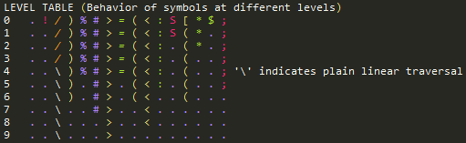

# DaoLanguage / Daoyu (道语)
---
&nbsp;&nbsp;&nbsp;&nbsp;&nbsp;&nbsp;&nbsp;&nbsp;**Daoyu**, or **DaoLanguage**, is a _self-modifying, imperative, simple, and minimal_ programming language modelled after about two or so tenets of Daoist philosophy. It is inspired by other elegant and minimal programming languages such as [Iota and Jot](http://semarch.linguistics.fas.nyu.edu/barker/Iota/) and the famous [FALSE](http://strlen.com/false-language), though the actual functionality bears little resemblance to that of either.  
&nbsp;&nbsp;&nbsp;&nbsp;&nbsp;&nbsp;&nbsp;&nbsp; It has a compiler and interpreter written in C.

### Running Daoyu Code
---
Download **dao.exe** and put it in a folder.  
Add that folder to your system %PATH%.  
Then, to see the instructional splash screen, enter:
    
    dao
This should display the list of flags and specific operating instructions.  
Daox.exe is a development version.

### Writing in Daoyu
---
&nbsp;&nbsp;&nbsp;&nbsp;&nbsp;&nbsp;&nbsp;&nbsp;Daoyu recognizes two file extensions:
* **.dao** - symbolic source code _(for compilation)_
* **.wuwei** - compiled tetrad code _(for execution)_  

##### &nbsp;&nbsp;&nbsp;&nbsp;&nbsp;&nbsp;&nbsp;&nbsp;**.dao** is a text-editable format containing the 16 Daoyu Human-Friendly Symbols:
![. IDLES, ! SWAPS, / LATER, \]) MERGE, % SIFTS, # EXECS, > DELEV, = EQUAL, ( HALVE, < UPLEV, : READS, S DEALC, \[ SPLIT, * POLAR, $ DOALC, ; INPUT](SYMBOLS.png)
&nbsp;&nbsp;&nbsp;&nbsp;&nbsp;&nbsp;&nbsp;&nbsp;All symbols in a line after '@' will not be read by the compiler.  
&nbsp;&nbsp;&nbsp;&nbsp;&nbsp;&nbsp;&nbsp;&nbsp;The following table describes the functionality of "Level." At the level shown on the left hand column, the functionality of the symbol first defined at **level 0**  should be altered to that at the appropriate row of level. For example, at **level 1**, SPLIT is interpreted as HALVE and DOALC is treated as IDLES.  
  
&nbsp;&nbsp;&nbsp;&nbsp;&nbsp;&nbsp;&nbsp;&nbsp;Read the text file specs.txt for more details. (Summary coming soon)

##### &nbsp;&nbsp;&nbsp;&nbsp;&nbsp;&nbsp;&nbsp;&nbsp;**.wuwei** is a compiled, binary code data file that can be directly read as a Daoyu program.
&nbsp;&nbsp;&nbsp;&nbsp;&nbsp;&nbsp;&nbsp;&nbsp;When a .dao file is compiled, the symbols are replaced with the 4-bit codes as shown in the above table. The interpreter or compiler, when provided with the .wuwei file, should then load the data directly into memory as an unbroken data tape and call EXECS from its beginning.

&nbsp;&nbsp;&nbsp;&nbsp;&nbsp;&nbsp;&nbsp;&nbsp;A .wuwei file can be edited by a hex editor, but is not as human-friendly in editing as .dao files are, since comments are difficult in the limited alphabet of hexadecimal code.

&nbsp;&nbsp;&nbsp;&nbsp;&nbsp;&nbsp;&nbsp;&nbsp;Example Daoyu code can be found in the folder **dao/**. The folder **dao/tests/** contain testing programs that should be run with verbose activated, and the folder **dao/ex/** contains example programs.

### Example programs
---
| **FILENAME**    | **DATE WRITTEN** | **AUTHOR** | **SIZE** |**DESCRIPTION**                                                          |
|-----------------|------------------|------------|----------|-------------------------------------------------------------------------|
| helloworld.dao  | 2016-03-23       | Kaynato    | .....76b | Prints out "Hello world!" by writing the ASCII codes in 1 byte of data. |
| cat.dao         | 2016-03-25       | Kaynato    | ......4b | Prints out standard input to standard output.                           |
| helloworld2.dao | 2016-03-26       | Kaynato    | .....32b | Prints out "Hello world!" by reading it from the program memory.        |
| truth.dao       | 2016-03-28       | Kaynato    | ....136b | [A Truth Machine.](https://esolangs.org/wiki/Truth-machine)             |
|                 |                  |            |          |                                                                         |
|                 |                  |            |          |                                                                         |
|                 |                  |            |          |                                                                         |

### Version
---
1.0.0.0: 2016-03-28 - First release with a respectable README.md. Contains compiler and interpreter. Source code not yet obfuscated.
